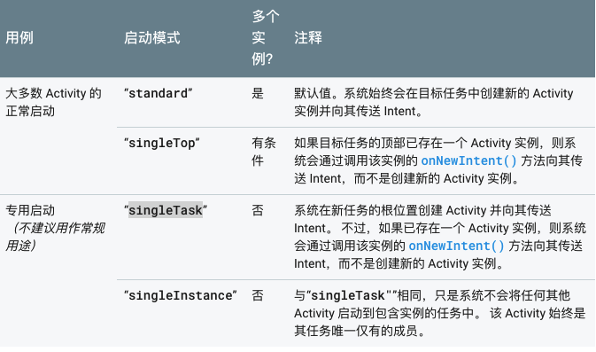

# Android面试题
## Activity 四种加载模式介绍

* standard:默认值。系统始终会在目标任务中创建新的 Activity 实例并向其传送 Intent。
* singleTop:如果目标任务的顶部已存在一个 Activity 实例，则系统会通过调用该实例的 onNewIntent() 方法向其传送 Intent，而不是创建新的 Activity 实例。
* singleTask:系统在新任务的根位置创建 Activity 并向其传送 Intent。 不过，如果已存在一个 Activity 实例，则系统会通过调用该实例的 onNewIntent() 方法向其传送 Intent，而不是创建新的 Activity 实例。
* singleInstance:与“singleTask"”相同，只是系统不会将任何其他 Activity 启动到包含实例的任务中。 该 Activity 始终是其任务唯一仅有的成员。

### 参考地址
[https://developer.android.com/guide/topics/manifest/activity-element](https://developer.android.com/guide/topics/manifest/activity-element)

## 事件分发
## 自定义View
## OOM
## Android GC策略
## 