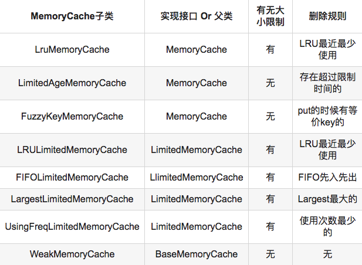

# Android面试题
## Activity 四种加载模式介绍

* standard:默认值。系统始终会在目标任务中创建新的 Activity 实例并向其传送 Intent。
* singleTop:如果目标任务的顶部已存在一个 Activity 实例，则系统会通过调用该实例的 onNewIntent() 方法向其传送 Intent，而不是创建新的 Activity 实例。
* singleTask:系统在新任务的根位置创建 Activity 并向其传送 Intent。 不过，如果已存在一个 Activity 实例，则系统会通过调用该实例的 onNewIntent() 方法向其传送 Intent，而不是创建新的 Activity 实例。
* singleInstance:与“singleTask"”相同，只是系统不会将任何其他 Activity 启动到包含实例的任务中。 该 Activity 始终是其任务唯一仅有的成员。

### 参考地址
[https://developer.android.com/guide/topics/manifest/activity-element](https://developer.android.com/guide/topics/manifest/activity-element)

## 事件分发
## 自定义View
## OOM
## Android GC策略
## Universal-Image-Loader
### 数据结构
* LinkedHashMap：
	* 说明
		* LinkedHashMap是Map接口的哈希表和链接列表实现，具有可预知的迭代顺序。此实现提供所有可选的映射操作，并允许使用null值和null键。此类不保证映射的顺序，特别是它不保证该顺序恒久不变。
		* LinkedHashMap实现与HashMap的不同之处在于，后者维护着一个运行于所有条目的双重链接列表。此链接列表定义了迭代顺序，该迭代顺序可以是**插入顺序**或者是**访问顺序**。
		
		* 注意，此实现不是同步的。如果多个线程同时访问链接的哈希映射，而其中至少一个线程从结构上修改了该映射，则它必须保持外部同步。
	* 实现
		* 对于LinkedHashMap而言，它继承与HashMap、底层使用哈希表与双向链表来保存所有元素。
		* 其基本操作与父类HashMap相似，它通过重写父类相关的方法，来实现自己的链接列表特性
	* 存储：LinkedHashMap并未重写父类HashMap的put方法，而是重写了父类HashMap的put方法调用的子方法void addEntry(int hash, K key, V value, int bucketIndex) 和void createEntry(int hash, K key, V value, int bucketIndex)，提供了自己特有的双向链接列表的实现
	* 读取：LinkedHashMap重写了父类HashMap的get方法，实际在调用父类getEntry()方法取得查找的元素后，再判断当排序模式accessOrder为true时，记录访问顺序，将最新访问的元素添加到双向链表的表头，并从原来的位置删除。由于的链表的增加、删除操作是常量级的，故并不会带来性能的损失。
	* 排序模式： LinkedHashMap定义了排序模式accessOrder，该属性为boolean型变量，对于访问顺序，为true；对于插入顺序，则为false。
		
			private final boolean accessOrder;  
	*  这些构造方法都会默认指定排序模式为插入顺序。如果你想构造一个LinkedHashMap，并打算按从近期访问最少到近期访问最多的顺序（即访问顺序）来保存元素，那么请使用下面的构造方法构造LinkedHashMap：

			public LinkedHashMap(int initialCapacity,  
	         float loadFactor,  
	                     boolean accessOrder) {  
		    super(initialCapacity, loadFactor);  
		    this.accessOrder = accessOrder;  
			}  
	* 该哈希映射的迭代顺序就是最后访问其条目的顺序，这种映射很适合构建LRU缓存。LinkedHashMap提供了removeEldestEntry(Map.Entry<K,V> eldest)方法，在将新条目插入到映射后，put和 putAll将调用此方法。该方法可以提供在每次添加新条目时移除最旧条目的实现程序，默认返回false，这样，此映射的行为将类似于正常映射，即永远不能移除最旧的元素。

			protected boolean removeEldestEntry(Map.Entry<K,V> eldest) {  
		    return false;  
			} 

	* 例如：重写此方法，维持此映射只保存100个条目的稳定状态，在每次添加新条目时删除最旧的条目。

			private static final int MAX_ENTRIES = 100;  
			protected boolean removeEldestEntry(Map.Entry eldest) {  
			    return size() > MAX_ENTRIES;  
			} 
	
* 注：
	* 用一个accessOrder为true的LinkedHashMap作为存储数据的数据结构
	* put方法是先调用super.put(key, value)再储存数据到本身。这很好理解嘛，前面说过的，数据的存储和获取是通过BaseMemoryCache实现的，因此只有高层成功存储了数据自身才存储数据
	* get方法与put方法相反，先是调用本身的get然后再返回父类的get，这里返回的是父类的get为什么还要多此一举调用本身的get干什么？这里调用get主要是为了触发accessOrder为true的LinkedHashMap的LRU算法，即把常用的数据移到队列的尾部，然后队头剩下的就是不常用的
	* removeNext()直接删除了LinkedHashMap队列头部的数据，这些数据是最近最少使用的数据，跟accessOrder为true的LinkedHashMap特性有关
	* 抽象方法getSize()用于计算传入的Bitmap的大小，这跟缓存的存储和删除改变的缓存大小密切相关，该方法由子类实现

### LRU算法

### 设计模式
* 全局单例模式
* 建造者模式（build模式）在ImageLoaderConfiguration和DisplayImageOptions都是使用了建造者模式，原因是它们有很多可选的属性可以被设置，使用建造者模式可以使得代码更清晰和健壮

### 多线程和线程池

其实这跟线程池的调优有关，如果我们将所有的任务都放在同一个线程池中运行当然是可以的，但是这样的话所有的任务就都只能采取同一种任务优先级和运行策略。显然果要有更好的性能，在线程数比较多并且线程承担的任务不同的情况下，App中最好还是按任务的类别来划分线程池

分析如下：

* taskDistributor由于在每创建一个新的线程的时候都需要读取一下磁盘，属于IO操作。需要图片缓存的应用一般在需要加载图片的时候，同时创建很多(>5)线程，这些线程一般来得猛去的也快，存活时间不必太长。
* taskDistributor和taskExecutorForCachedImages涉及网络和磁盘的读取和写入操作，比较耗时。主线程数默认为3，感觉定的低了，实际上IO密集的操作应该定得高一点，以便合理利用CPU的。线程优先级(10为最高，1为最低)为4是比较合理的，因为这些操作只需要后台完成即可，优先级太高可能让界面失去响应。

#### ThreadPoolExecutor
* corePoolSize（线程池的基本大小）：当提交一个任务到线程池时，线程池会创建一个线程来执行任务，即使其他空闲的基本线程能够执行新任务也会创建线程，等到需要执行的任务数大于线程池基本大小时就不再创建。如果调用了线程池的prestartAllCoreThreads方法，线程池会提前创建并启动所有基本线程。
* runnableTaskQueue（任务队列）：用于保存等待执行的任务的阻塞队列。 可以选择以下几个阻塞队列。
	* ArrayBlockingQueue：是一个基于数组结构的有界阻塞队列，此队列按 FIFO（先进先出）原则对元素进行排序。
	* LinkedBlockingQueue：一个基于链表结构的阻塞队列，此队列按FIFO （先进先出） 排序元素，吞吐量通常要高于ArrayBlockingQueue。静态工厂方法Executors.newFixedThreadPool()使用了这个队列。
	* SynchronousQueue：一个不存储元素的阻塞队列。每个插入操作必须等到另一个线程调用移除操作，否则插入操作一直处于阻塞状态，吞吐量通常要高于LinkedBlockingQueue，静态工厂方法Executors.newCachedThreadPool使用了这个队列。
	* PriorityBlockingQueue：一个具有优先级的无限阻塞队列。
* maximumPoolSize（线程池最大大小）：线程池允许创建的最大线程数。如果队列满了，并且已创建的线程数小于最大线程数，则线程池会再创建新的线程执行任务。值得注意的是如果使用了无界的任务队列这个参数就没什么效果。
* ThreadFactory：用于设置创建线程的工厂，可以通过线程工厂给每个创建出来的线程设置更有意义的名字。
* RejectedExecutionHandler（饱和策略）：当队列和线程池都满了，说明线程池处于饱和状态，那么必须采取一种策略处理提交的新任务。这个策略默认情况下是AbortPolicy，表示无法处理新任务时抛出异常。以下是JDK1.5提供的四种策略。
	* AbortPolicy：直接抛出异常。
	* CallerRunsPolicy：只用调用者所在线程来运行任务。
	* DiscardOldestPolicy：丢弃队列里最近的一个任务，并执行当前任务。
	* DiscardPolicy：不处理，丢弃掉。
	* 当然也可以根据应用场景需要来实现RejectedExecutionHandler接口自定义策略。如记录日志或持久化不能处理的任务。
* keepAliveTime（线程活动保持时间）：线程池的工作线程空闲后，保持存活的时间。所以如果任务很多，并且每个任务执行的时间比较短，可以调大这个时间，提高线程的利用率。
* TimeUnit（线程活动保持时间的单位）：可选的单位有天（DAYS），小时（HOURS），分钟（MINUTES），毫秒(MILLISECONDS)，微秒(MICROSECONDS, 千分之一毫秒)和毫微秒(NANOSECONDS, 千分之一微秒)。

#### Executors静态工厂方法创建的线程池类型：
* a) newFixedThreadPool：创建一个定长的线程池。达到最大线程数后，线程数不再增长。如果一个线程由于非预期Exception而结束，线程池会补充一个新的线程。
* b) newCachedThreadPool：创建一个可缓存的线程池。当池长度超过处理需求时，可以回收空闲的线程。
* c) newSingleThreadPool：创建一个单线程executor。
* d) newScheduledThreadPool：创建一个定长的线程池，而且支持定时的以及周期性的任务执行。类似于Timer。但是，Timer是基于绝对时间，对系统时钟的改变是敏感的，而ScheduledThreadPoolExecutor只支持相对时间。
	* 1) Timer是创建唯一的线程来执行所有的timer任务。如果一个任务超时了，会导致其他的TimerTask时间准确性出问题。
	* 2）如果TimerTask抛出uncheck 异常，Timer将会产生无法预料的行为。因此，ScheduledThreadPoolExecutor可以完全代替Timer。

####  合理的配置线程池
* 要想合理的配置线程池，就必须首先分析任务特性，可以从以下几个角度来进行分析：
	* 任务的性质：CPU密集型任务，IO密集型任务和混合型任务。
	* 任务的优先级：高，中和低。
	* 任务的执行时间：长，中和短。
	* 任务的依赖性：是否依赖其他系统资源，如数据库连接。
* 任务性质不同的任务可以用不同规模的线程池分开处理。CPU密集型任务配置尽可能小的线程，如配置Ncpu+1个线程的线程池。IO密集型任务则由于线程并不是一直在执行任务，则配置尽可能多的线程，如2*Ncpu。混合型的任务，如果可以拆分，则将其拆分成一个CPU密集型任务和一个IO密集型任务，只要这两个任务执行的时间相差不是太大，那么分解后执行的吞吐率要高于串行执行的吞吐率，如果这两个任务执行时间相差太大，则没必要进行分解。我们可以通过Runtime.getRuntime().availableProcessors()方法获得当前设备的CPU个数。

* 优先级不同的任务可以使用优先级队列PriorityBlockingQueue来处理。它可以让优先级高的任务先得到执行，需要注意的是如果一直有优先级高的任务提交到队列里，那么优先级低的任务可能永远不能执行。

* 执行时间不同的任务可以交给不同规模的线程池来处理，或者也可以使用优先级队列，让执行时间短的任务先执行。

* 依赖数据库连接池的任务，因为线程提交SQL后需要等待数据库返回结果，如果等待的时间越长CPU空闲时间就越长，那么线程数应该设置越大，这样才能更好的利用CPU。

* 建议使用有界队列，有界队列能增加系统的稳定性和预警能力，可以根据需要设大一点，比如几千。有一次我们组使用的后台任务线程池的队列和线程池全满了，不断的抛出抛弃任务的异常，通过排查发现是数据库出现了问题，导致执行SQL变得非常缓慢，因为后台任务线程池里的任务全是需要向数据库查询和插入数据的，所以导致线程池里的工作线程全部阻塞住，任务积压在线程池里。如果当时我们设置成无界队列，线程池的队列就会越来越多，有可能会撑满内存，导致整个系统不可用，而不只是后台任务出现问题。当然我们的系统所有的任务是用的单独的服务器部署的，而我们使用不同规模的线程池跑不同类型的任务，但是出现这样问题时也会影响到其他任务。

