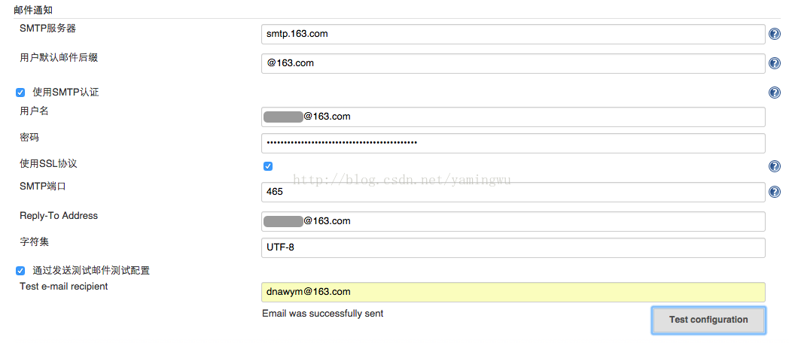

# Jenkins使用笔记
## java
## Android SDK
## Git
## Jenkins插件列表

## Gradle(可选)

## 二维码生成

## ssh
ssh-keygen -t rsa -C "youremail@example.com"

## 运行命令（war）

    java -jar jenkins.war

## Node

npm install http-server -g

## 构建操作

    echo %JOB_NAME%
    echo %BUILD_NUMBER%
    echo %WORKSPACE%
    copy %WORKSPACE%\app\build\outputs\apk\debug\app-debug.apk C:\Users\{user}\public\apk\%JOB_NAME%-debug-%BUILD_NUMBER%.apk
    cd C:\jenkins
    java -jar qr.jar url=http://10.1.17.54:8000/apk/%JOB_NAME%-debug-%BUILD_NUMBER%.apk image=%JOB_NAME%-debug-%BUILD_NUMBER%.jpg save=C:\Users\zhangtj-a\public\qr_img

## Set build desc

    


## 邮件通知格式

163邮箱通知设置

https://blog.csdn.net/yamingwu/article/details/44142635

### 模板一

```
Jenkins构建通知:$PROJECT_NAME - Build # $BUILD_NUMBER - $BUILD_STATUS!
```

```
<hr/>

(本邮件是程序自动下发的，请勿回复！)<br/><hr/>

项目名称：$PROJECT_NAME<br/><hr/>

构建编号：$BUILD_NUMBER<br/><hr/>

触发原因：${CAUSE}<br/><hr/>

构建状态：$BUILD_STATUS<br/><hr/>

扫描二维码 
<br/>
下载地址：<a href="http://10.1.90.39:8000/apk/${JOB_NAME}-${BUILD_NUMBER}.apk">http://10.1.90.39:8000/apk/${JOB_NAME}-${BUILD_NUMBER}.apk</a><br>

<hr/>

构建日志地址：<a href="${BUILD_URL}console">${BUILD_URL}console</a><br/><hr/>

构建地址：<a href="$BUILD_URL">$BUILD_URL</a><br/><hr/>

变更集:${JELLY_SCRIPT,template="html"}<br/><hr/>
```

### 模板二

```
Jenkins构建通知:$PROJECT_NAME - Build # $BUILD_NUMBER - $BUILD_STATUS!
```

(邮件由Jenkins自动发出，请勿回复~)<br>
项目名称：$PROJECT_NAME<br>
构建编号：$BUILD_NUMBER<br>
构建状态：$BUILD_STATUS<br>
触发原因：${CAUSE}<br>
构建地址：<A HREF="${BUILD_URL}">${BUILD_URL}</A><br>
构建输出日志：<a href="${BUILD_URL}console">${BUILD_URL}console</a><br>
下载地址：<a href="http://10.1.67.54:8000/apk/${JOB_NAME}-debug-${BUILD_NUMBER}.apk">http://10.1.67.54:8000/apk/${JOB_NAME}-debug-${BUILD_NUMBER}.apk</a><br><br>
二维码下载：<br>
最近修改：<br>${CHANGES, showPaths=false, format="%a：\"%m\"<br>", pathFormat="\n\t- %p"}


## 疑难解决
###  553 Mail from must equal authorized user

有些人错误为501 mail from address must be same as authorization user;其实问题是一样的

需要在Jenkins Location中配置系统管理员邮件地址


解决方式如下：
https://blog.csdn.net/yamingwu/article/details/44142635

## 参考
https://blog.csdn.net/u013066244/article/details/78665075

