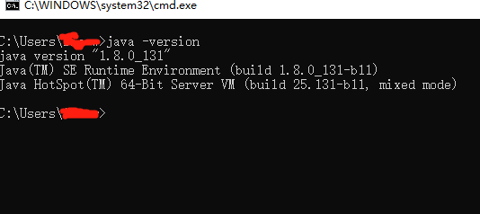

# Jenkins+AndroidSDK+Node.js+http-server+qr.jar+163邮箱服务

## java 

### 安装

下载地址：http://www.oracle.com/technetwork/java/javase/downloads/index.html

根据电脑环境安装合适的版本

### 配置

    在"用户变量"中设置3项属性，JAVA_HOME,PATH,CLASSPATH(不区分大小写),若已存在则点击"编辑"，注意用分号与前面的隔开，不存在则点击"新建"。

    变量设置参数如下：

    变量名： JAVA_HOME
    变量值： C:\Program Files\Java\jdk1.8.0_111
    变量名： Path
    变量值： %JAVA_HOME%\bin;%JAVA_HOME%\jre\bin;
    变量名： CLASSPATH
    变量值： .;%JAVA_HOME%\lib\dt.jar;%JAVA_HOME%\lib\tools.jar;       注意：这前面有一个点‘.’


### 测试

    command(window键)+R,然后输入cmd,确定后输入命令: java、javac 几个命令


## Android SDK
### 安装
### 配置
### 测试

## Git
### 安装
### 配置
### 测试

## ssh
ssh-keygen -t rsa -C "youremail@example.com"

## Jekins

### 安装
### 配置
### 测试

http://jenkins-ci.org/


## 运行命令（war）

    java -jar jenkins.war

## Jenkins插件列表

## Gradle(可选)
### 安装
### 配置
### 测试

## 二维码生成
### 安装
### 配置
### 测试


## Node
### 安装
### 配置
### 测试
npm install http-server -g

## 配置Job

### 构建触发器

时间设置说明

        * * * * *
        (五颗星，中间用空格隔开）
        第一颗*表示分钟，取值0~59
        第二颗*表示小时，取值0~23
        第三颗*表示一个月的第几天，取值1~31
        第四颗*表示第几月，取值1~12
        第五颗*表示一周中的第几天，取值0~7，其中0和7代表的都是周日

例子如下：


        每15分钟构建一次：H/15 * * * *   或*/5 * * * *
        每天8点构建一次：0 8 * * *
        每天8点~17点，两小时构建一次：0 8-17/2 * * *
        周一到周五，8点~17点，两小时构建一次：0 8-17/2 * * 1-5
        每月1号、15号各构建一次，除12月：H H 1,15 1-11 *
        */5 * * * * （每5分钟检查一次源码变化）
        0 2 * * * （每天2:00 必须build一次源码）

### 构建操作

    echo %JOB_NAME%
    echo %BUILD_NUMBER%
    echo %WORKSPACE%
    copy %WORKSPACE%\app\build\outputs\apk\debug\app-debug.apk C:\Users\{user}\public\apk\%JOB_NAME%-debug-%BUILD_NUMBER%.apk
    cd C:\jenkins
    java -jar qr.jar url=http://10.1.17.54:8000/apk/%JOB_NAME%-debug-%BUILD_NUMBER%.apk image=%JOB_NAME%-debug-%BUILD_NUMBER%.jpg save=C:\Users\zhangtj-a\public\qr_img

### Set build desc

    


### 邮件通知格式

163邮箱通知设置

https://blog.csdn.net/yamingwu/article/details/44142635

#### 模板一

```
Jenkins构建通知:$PROJECT_NAME - Build # $BUILD_NUMBER - $BUILD_STATUS!
```

```
<hr/>

(本邮件是程序自动下发的，请勿回复！)<br/><hr/>

项目名称：$PROJECT_NAME<br/><hr/>

构建编号：$BUILD_NUMBER<br/><hr/>

触发原因：${CAUSE}<br/><hr/>

构建状态：$BUILD_STATUS<br/><hr/>

扫描二维码 
<br/>
下载地址：<a href="http://10.1.90.39:8000/apk/${JOB_NAME}-${BUILD_NUMBER}.apk">http://10.1.90.39:8000/apk/${JOB_NAME}-${BUILD_NUMBER}.apk</a><br>

<hr/>

构建日志地址：<a href="${BUILD_URL}console">${BUILD_URL}console</a><br/><hr/>

构建地址：<a href="$BUILD_URL">$BUILD_URL</a><br/><hr/>

变更集:${JELLY_SCRIPT,template="html"}<br/><hr/>
```

#### 模板二

```
Jenkins构建通知:$PROJECT_NAME - Build # $BUILD_NUMBER - $BUILD_STATUS!
```

(邮件由Jenkins自动发出，请勿回复~)<br>
项目名称：$PROJECT_NAME<br>
构建编号：$BUILD_NUMBER<br>
构建状态：$BUILD_STATUS<br>
触发原因：${CAUSE}<br>
构建地址：<A HREF="${BUILD_URL}">${BUILD_URL}</A><br>
构建输出日志：<a href="${BUILD_URL}console">${BUILD_URL}console</a><br>
下载地址：<a href="http://10.1.67.54:8000/apk/${JOB_NAME}-debug-${BUILD_NUMBER}.apk">http://10.1.67.54:8000/apk/${JOB_NAME}-debug-${BUILD_NUMBER}.apk</a><br><br>
二维码下载：<br>
最近修改：<br>${CHANGES, showPaths=false, format="%a：\"%m\"<br>", pathFormat="\n\t- %p"}

> 建议使用“邮箱大师”|“Foxmail”接收邮件

## 疑难解决
###  553 Mail from must equal authorized user

有些人错误为501 mail from address must be same as authorization user;其实问题是一样的

需要在Jenkins Location中配置系统管理员邮件地址


解决方式如下：
https://blog.csdn.net/yamingwu/article/details/44142635


### SSLHandshakeException
---
There were errors checking the update sites: SSLHandshakeException: sun.security.validator.ValidatorException: PKIX path building failed: sun.security.provider.certpath.SunCertPathBuilderException: unable to find valid certification path to requested target

---

## 参考
https://blog.csdn.net/u013066244/article/details/78665075

