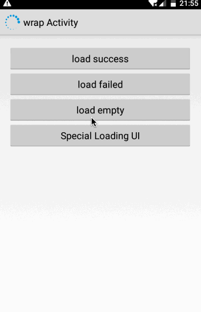
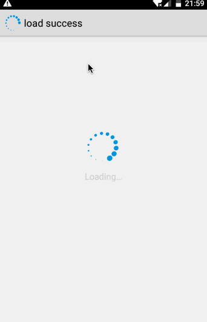
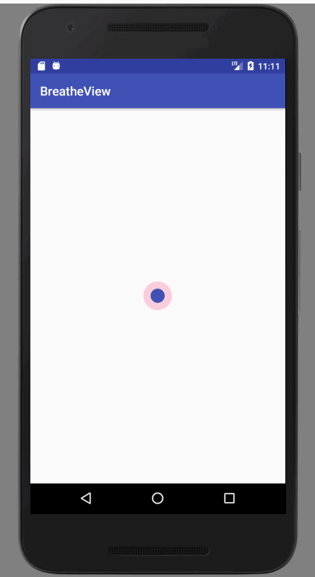
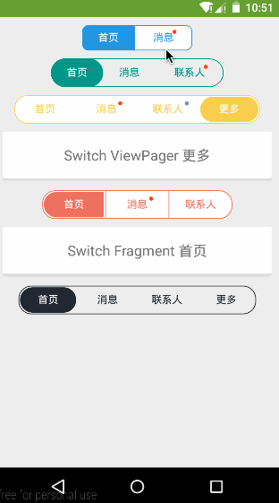

## 加载进度条-Gloading

[gloding](https://github.com/luckybilly/Gloading)

## 记录

## 圆呼吸效果 

* ValueAnimator

* https://github.com/Jeromeer/BreatheView

https://blog.csdn.net/hardworkingant/article/details/78158154

https://github.com/evrencoskun/TableView

https://github.com/H07000223/FlycoTabLayout

https://github.com/ogaclejapan/SmartTabLayout

