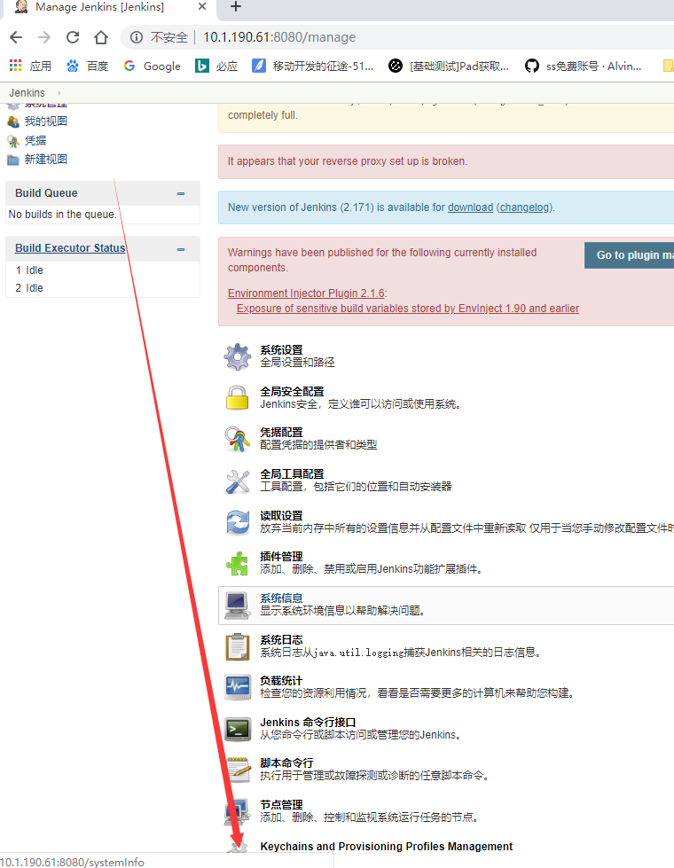

## Jenkins安装
## IOS插件安装列表

* Keychains and Provisioning Profiles Management
* Xcode integration

## 配置Keychains and Provisioning Profiles Management

根据顺序选择首页>系统管理>Keychains and Provisioning Profiles Management

需要上传login.keychain文件，该文件获取方法，在终端中输入
>cd ~/Library/Keychains

将login.keychain文件upload之后，会出现下图的界面，根据需要将证书添加进去即可，但是由于macOS10.12以及以后的系统里面没有login.keychain文件，只有login.keychain-db,可以复制出来删除-db，也可以创建一个快捷方式名字叫做login.keychain，upload就好了

>cp login.keychain-db ~/Desktop/login.keychain

### 添加Provisioning Profiles

https://www.jianshu.com/p/0affef7cef69

## Job参数配置
## 发布上传fri或者蒲公英等第三方

## 填坑记录

## 参考
[https://www.pgyer.com/doc/view/jenkins](https://www.pgyer.com/doc/view/jenkins)
[https://www.jianshu.com/p/3668979476ad](https://www.jianshu.com/p/3668979476ad)