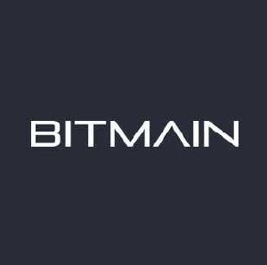
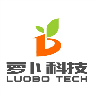
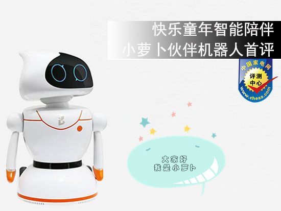
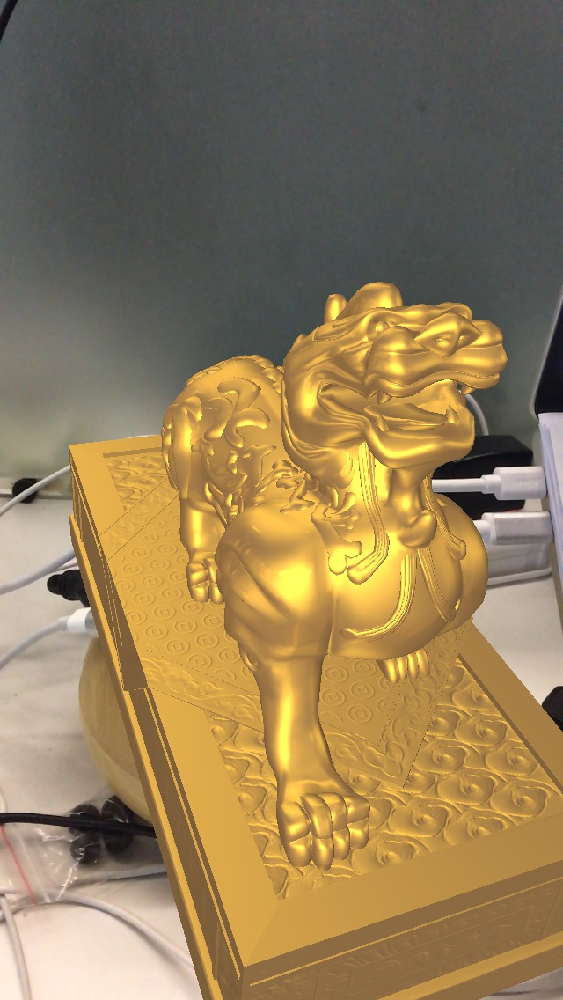
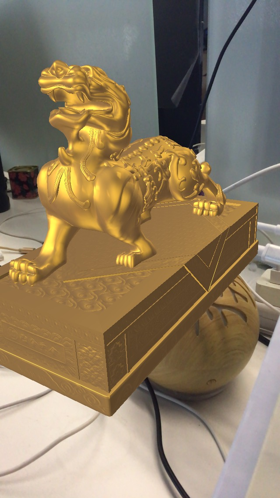
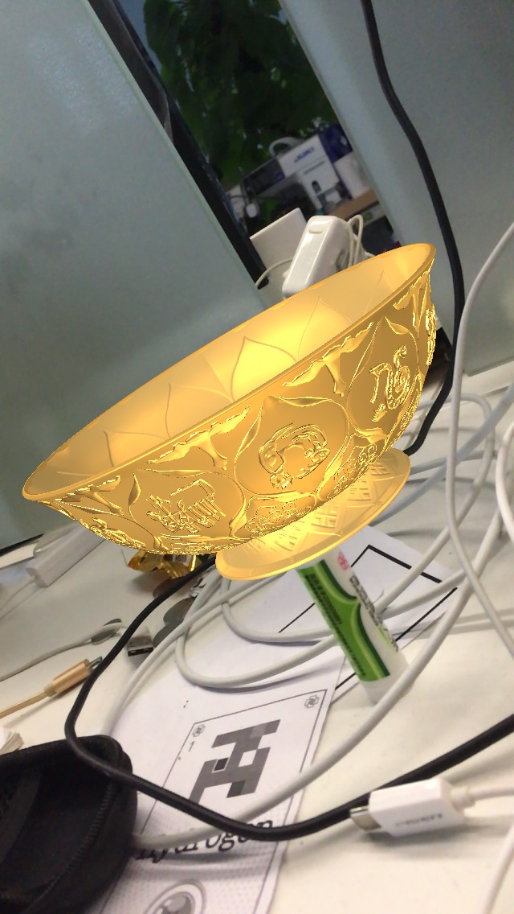
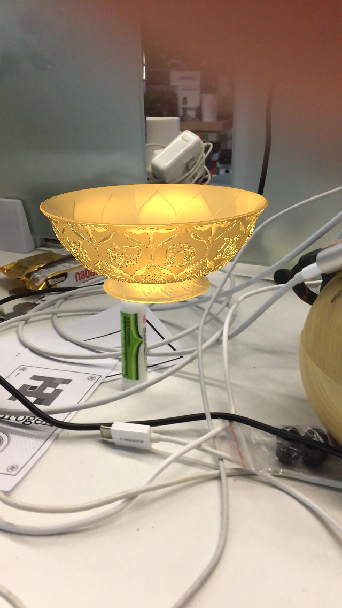
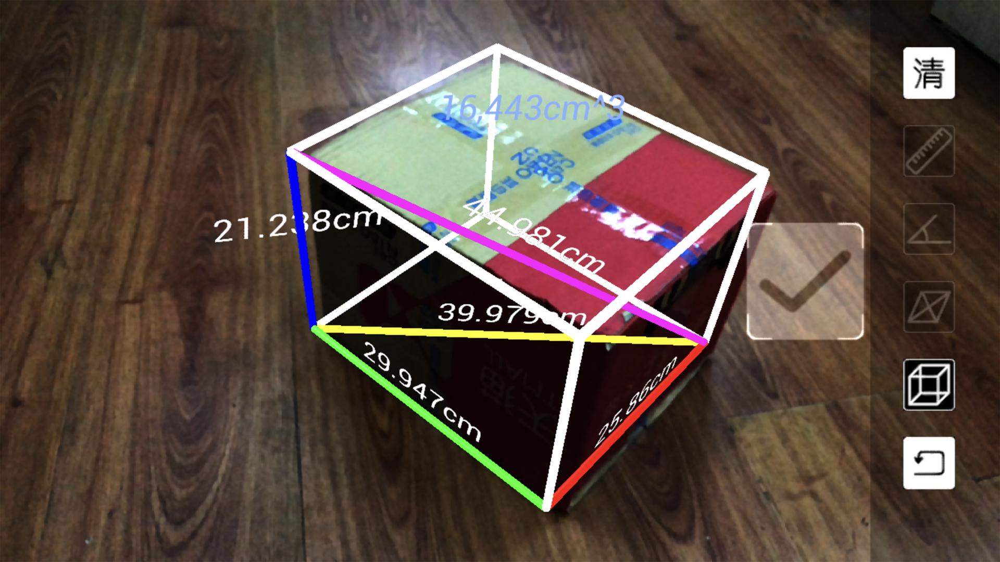
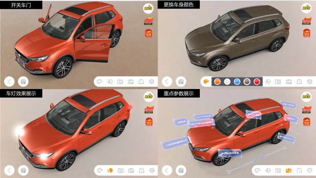

# 李冲|Android开发(AR方向)
男 | 29岁 | 本科 | **13718425650** | <lichongmac@163.com> 

 : [https://github.com/lichong951](https://github.com/lichong951) | 博客 ：[http://blog.51cto.com/4789781](http://blog.51cto.com/4789781)

### 工作及项目经历
## 亮风台

2017.5 ~ 2018.12 | Android开发（AR方向）
#### 岗位职责
* 根据客户AR场景业务需求，设计开发Android端AR技术解决方案
* 探索预研ARCore、ARKit等AR框架与HiAR框架的融合解决方案，交付HiARSDK给客户使用
* 快速开发出客户需要的AR场景效果Demo。以适应项目后期越来越快的需求演进变化
* 包括但不限于使用**ARCore**、**ARKit**、**Vuforia**、**easyAR**、**HiAR**等AR技术框架；**HoloLens**、**HiAR** **G100|G200** 等AR眼镜。解决AR项目中业务需求。
* 包括但不限于使用Android studio、XCode、U3D、UE4等IDE工具完成AR前沿技术调研

#### 业绩

* 银行类：
	* 民生银行AR解决方案（AS）
	* 中原银行能力认证（POC）AR解决方案（AS）
* 电商类：
	* 京东电饭煲AR使用说明书（U3D）
* 汽车类：
	* 汽车之家AR解决方案（AS）
	* 上汽AR使用说明书（AS）
	* 猎豹汽车AR使用说明书（AS）
* 旅游类：
	* 故宫展品AR解决方案（AS）
	* 玉泉旅游AR解决方案（AS）
* 教育类：
	* 河北师大AR实验室化学分子式-IPad版（U3D | XCode）
	
### 其他
相关AR介绍视频如下：

* AR实战视频介绍地址：[http://list.youku.com/albumlist/show/id_52006340](http://list.youku.com/albumlist/show/id_52006340)
* ARCore视频介绍地址：[http://list.youku.com/albumlist/show/id_52006304](http://list.youku.com/albumlist/show/id_52006304)
* ARKit视频介绍地址：[http://list.youku.com/albumlist/show/id_51981529](http://list.youku.com/albumlist/show/id_51981529)

相关AR图片介绍见 [附一](#one)

## 比特大陆|新物种公司（原北京小萝卜科技有限公司）

&emsp;&emsp;&emsp;&emsp;

2015.5 ~ 2017.2 Android开发（机器人）

#### 产品介绍：

* 一个童年一个机器人陪伴。功能包括
	* 情感成长-陪玩耍
	* 记忆成长-陪聊天
	* 智慧成长-陪学习等
* 陪玩耍：小萝卜伙伴机器人配合APP使用，可以自主设计舞蹈和路径编程
* 陪聊天：语音对话、智趣非凡：小萝卜伙伴机器人具有准确的语音识别和强大的语义分析技术，语音对话功能强大。小朋友可以直接和它聊天对话，卖萌撒娇无所不通，是小朋友的良师益友和亲密的小伙伴。
* 陪学习：专业早教内容、人格养成
* DIY编程、益智成长：小萝卜伙伴机器人配合APP使用，可以自主设计舞蹈和路径编程。孩子在编程过程中开发了思维架构，激发了独立探索能力，获得成就感的同时真正实现了寓教于乐，提高了孩子的逻辑思维能力。只要你有足够的创意和想象力，就可以尽情展现小萝卜的动感舞姿，也可以在小小的客厅里玩出丛林穿越的奇妙感觉。

#### 岗位职责
* 根据对小小萝卜机器人的描述制定具体的开发计划，并验证相关参数是否可达（如：30s内完成系统以及应用启动、语音识别延时等）
* 以机器人Android板为核心，对接底层硬件控制板、上层云服务器、手机App控制器命令；协调底层控制命令、手机app控制命令、语音控制命令等多种交互模式自然融合。
* 为流水线生产小萝卜机器人提供机器人功能验收流程以及标准。并攻克在工厂生产过程中遇到Android技术难关
* 负责面试Android工程师，以及对新入职Android工程师进行业务技术培训，使其尽快融入快节奏的迭代开发过程中。
* 预研能提高小萝卜机器人交互体验的第三方技术（如：语音技术：科大讯飞、思必驰、灵伴等。音视频技术框架等。人脸识别、手势识别、小范围办公物体识别、视频通话等）

#### 业绩
* 解决初代小萝卜30s开机系统应用启动；小萝卜舞蹈规范；语音交互技术选型融合；加强并丰富了小萝卜机器人的用户体验
* 在产品交付日期内，解决由于Android板厂商临时涨价后替换了Android系统以及版本带来的整体软件系统二次开发。攻克由于系统版本提升导致的一系列适配（如：开机启动时间、自动更新应用、系统权限解决方案等）
* 临危受命维修参加绵阳展览会的小萝卜机器人。顺利完成绵阳电视台的采访表演任务。保证为期几天的展会小萝卜机器人可用可玩。
* 优化二代小萝卜机器人开发解决方案，提前保质保量完成二代小萝卜机器人开发。顺利展示给公司战略合作伙伴。

## 车讯互联

2012.6 ~ 2015.5  Android开发（汽车媒体）

#### 买车通 

#### 岗位职责
* 负责公司Android客户端《买车通》开发
* 各大经销商4s店app开发、维护，版本迭代
* 技术面试Android工程师

#### 业绩
* 《买车通》4.0成功发布；并持续更新版本到4.1.1
* 人数由独立开发增加到3个开发工程师协作开发，对新入职员工进行业务培训和技术指导
* 针对UI适配、机型适配、分辨率适配进行合理的优化并稳步迭代提升交互体验
* 在完成开发任务的同时给予产品迭代方案、UI设计方案、测试方案等符合实际情况的建议，协调各个环节保质保量的完成研发任务。

#### 其他：
官网地址：[http://www.chexun.com](http://www.chexun.com)

## 教育经历
2010 - 2012 | 衡水学院 | 本科 | 计算机

2007 ~ 2010 | 河北金融学院 | 专科 | 计算机网络

## 专业技能
### 语言类
* **Java**	&emsp;&emsp;&emsp;&emsp;熟悉Java的编辑运行，理解Java OpenGL；熟练使用常见设计模式、线程池多线程技术

* **C#**	&emsp;&emsp;&emsp;&emsp;熟悉C#编辑运行；常使用U3D+Visual Studio

* **C/C++**	&emsp;&emsp;&emsp;&emsp;了解C/C++编辑运行；熟悉JNI接口编辑运行

* **Python**	&emsp;&emsp;&emsp;&emsp;了解Python的编程运行；曾使用Python运行Tensflow训练模型

* **JavaScript**	&emsp;&emsp;&emsp;&emsp;了解JavaScript编辑运行；常使用在Android WebView里进行JS交互；也经常用在Node.js搭建本地服务器脚本编辑

* **Lua**	&emsp;&emsp;&emsp;&emsp;了解CAPI以及Lua调用C、C++方法；常用来编辑屏幕模型与用户的交互处理，增强用户体验。也被看作是游戏脚本

* **Web前端**	&emsp;&emsp;&emsp;&emsp;能进行简单Web前端和后端开发

### 工具类	

* IDE类：
	* Android studio:常用于开发Android App
	* XCode：通常结合U3D快速开发出AR场景Demo效果
	* Unity3D：常用于ARKit、ARCore和Vuforia快速开发出AR效果demo
	* Visual Studio
	* Jenkins:自动化构建、打包、单元测试、UI测试、性能测试、功能测试、Monkey测试等
	* Cmake：构建c、c++项目打包生成so文件
	* MacDown：编辑文档工具
	* Git：版本工具
* 常用SDK和开发框架：
	* Android SDK
	* Android NDK
	* JDK
	* IOS SDK
	* Junit
	* Espresso
	* Gradle
	* cmake
	* Node.js
	* ARKit
	* ARCore
	* Vuforia
	* MyQR
	* SVN
		

## 附一
银行类：

&emsp;&emsp;&emsp;&emsp;

&emsp;&emsp;&emsp;&emsp;

电商类：

汽车类：

 