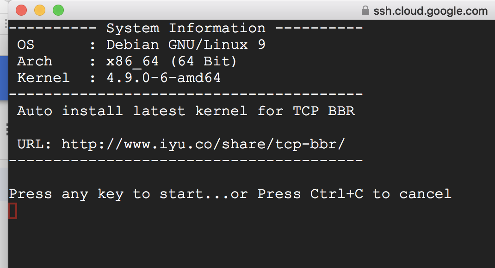

# 【VPN】国际云平台搭建
## 准备工作
【Mac】软件下载地址：[https://github.com/qinyuhang/ShadowsocksX-NG-R/releases
](https://github.com/qinyuhang/ShadowsocksX-NG-R/releases
)
【PC】[https://github.com/shadowsocksrr/shadowsocksr-csharp/releases](https://github.com/shadowsocksrr/shadowsocksr-csharp/releases)

linux服务启动命令教程（谷歌云平台为例）
	
	1：sudo -i

	(最前面显示root@xxxx)
	
	BBR加速 有两套代码，选其一。
	
	2（第一套）：wget -N --no-check-certificate https://raw.githubusercontent.com/FunctionClub/YankeeBBR/master/bbr.sh && bash bbr.sh install
	
	蓝底窗口按TAB键选NO
	
	选择重启 Y
	
	这里会断开连接，大家可以关掉窗口再重新打开或几秒钟后在界面随便按几个字母 便会提示重新连接。
	
	如果用第一套 就按照顺序继续 第2步完了 第3步 第4步。。。
	（第二套） TCP-BBR加速方案 用这套代码 完事以后可以直接到第5步！
	
	wget --no-check-certificate https://github.com/iyuco/scripts/raw/master/bbr.sh
	chmod +x bbr.sh
	./bbr.sh

复制过去以后便会自动开始当显示./bbr.sh 的时候回车

	

到这个界面的时候再按回车

出现这个地方的时候输入y重启 (重启几秒钟后在界面随便按几个字母 便会提示重新连接）然后输入
sudo -i
(最前面显示root@xxxx)
并直接跳转第5步继续
继续

	3：sudo -i
	
	(最前面显示root@xxxx)
	
	4：bash bbr.sh start
	
	如果用的第二套代码这3.4 这两步步跳过
	
	5：wget --no-check-certificate https://raw.githubusercontent.com/teddysun/shadowsocks_install/master/shadowsocksR.sh && chmod +x shadowsocksR.sh
	
	6：./shadowsocksR.sh
	
	输入shadowsocks 密码
	
	输入端口号
	
	其他一路回车（也可自行选择混淆 协议）
	
	谷歌云防火墙规则添加 （位置在谷歌云 VPC网络-防火墙）
	点击添加新规则，然后按照一下这个设置好。这样 SSR 设置任何端口都可以使用。并且后续不需要再来防火墙规则做设置了。缺点是 所有端口开放。当然也会有一些危险。

>补充 不稳定，所以加了个自动重启的脚本
	
	reboot script
	1、Put the script reboot.sh in a directory like /home/yourname/scripts,
	and make it executable by chmod a+x reboot.sh.
	#!/bin/sh
	
	# 2>&1  : output stderr to stdout
	date -R >> /home/yourname/logs/reboot_log 2>&1
	/sbin/reboot
	
	2、sudo -i and crontab -e.
	
	3、Copy this line to the tail: 0 4 * * * /home/yourname/scripts/reboot.sh,
	save and exit, and it will run reboot.sh at 4:00 AM every day.
	
	4、/etc/init.d/cron restart. (Note that this may not needed)
	
	重启使用说明
	SSH登陆你的VM实例
	输入sudo -i回车，输入crontab -e，回车，若第一次运行这个命令，会让你选择一个文本编辑器，
	再次回车选择默认即可（nano)。
	移动光标到最后一行，复制粘贴这句1 20 * * * reboot.
	注意，这里的前两个参数1 20表示UTC时间20:01，即为我国的凌晨4:01，可以自行调整。
	依次按CTRL + x，y，回车。表示保存，退出。
	看到屏幕打印crontab: installing new crontab即表示成功设置定时重启任务

## 亚马孙云平台（AWS）

#### 参考地址
[Amazon EC2 Linux 实例入门](http://docs.amazonaws.cn/AWSEC2/latest/UserGuide/EC2_GetStarted.html)
## Microsoft Azure

## 其他
> 如果遇到速度慢、不稳定的

	友情提示：按照视频中的方法搭建好谷歌云服务器的朋友，如果遇到速度慢、不稳定的情况，可以尝试一下方法，进入谷歌云点左上角的三横，点VPC网络，找到外部IP位址，点击进入。找到你建立的VM实例，将类型选项的临时改成静态就O啦。非常感谢楼主的分享！另外很多人对于谷歌云服务器建立好以后，不知道怎么使用。其实你只要在你要连接服务器的设备上下载一个SSR的软件就行，比如影梭，手机安卓用户可以在谷歌商店找到该应用。iOS用户除了某宝购买境外苹果账户下载wingy 这个app外，也可以通过手机越狱后安装网上找来的ssr应用来实现连接。
	
> 港澳台的Apple ID

	其實港澳台的Apple ID並不需要花那筆錢去taobao買賬戶，其實可以透過郵箱分身（QQ郵箱好像就提供有兩個址）註冊新賬戶，國家地區隨意更換即可。

## 参考地址
[如何注册美区的 Apple ID ？](https://www.tbreak.top/kda/398/)

## 联系我
> Email:lichongmac@163.com

支付宝打赏：[https://pan.baidu.com/s/1UMWjU1FHv7hYpdlcCQrJ3A](https://pan.baidu.com/s/1UMWjU1FHv7hYpdlcCQrJ3A)

微信打赏：[https://pan.baidu.com/s/1dSBXk3eFZu3mAMkw3xu9KQ](https://pan.baidu.com/s/1dSBXk3eFZu3mAMkw3xu9KQ)

公众号推荐：

