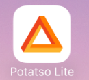
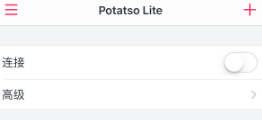
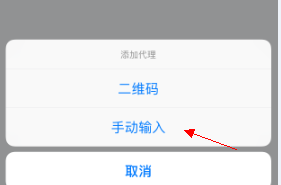
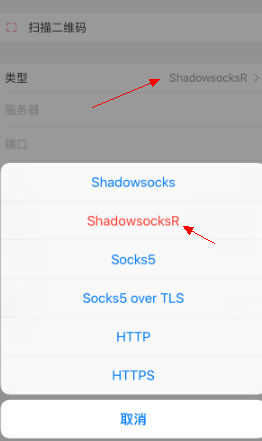
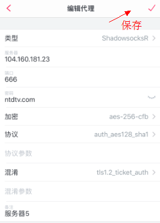
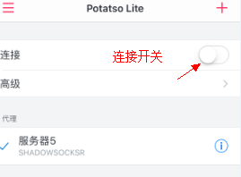

# 【VPN】苹果手机翻墙说明

## 一个普通的程序员 + Google = 一个超级程序员

## 安装SS客户端
由于我分享的SSR账号支持SS客户端了，所以只要能够在大陆APP商店下载到能用SS账号的客户端即可，方便下载不到SSR客户端的朋友。比如：superwingy、firstwingy、shadowingy、wingy+、banananet、kite-ss proxy、goodshadow、icproyx、shadowrocket等

Potatso Lite、Potatso、shadowrocket可以作为SSR客户端，但这些软件目前已经在国内的app商店下架，需要用美区的appid账号来下载才行
以Potatso Lite为例，具体配置方法：

1. 开始进行配置账号信息，选择右上角的 +

2. 点击手动输入

3. 类型有多种，可根据需求进行选择，这里以SSR为例

4. 填好信息后，点击右上角的勾，保存即可

 

## 其他【Mac】翻墙软件
> 已安装HOMEbrew 环境 可使用如下命令安装软件
	
	brew install shadowsocksx

> 下载地址：
	
	链接: https://pan.baidu.com/s/1heeA5jDJGIitGR9Fg87d2g 密码: cfrm

## 免费账号

注意：不保证本账号一直可用，如果不可用请联系我

#### 联系我

 > Email: lichongmac@163.com 
	
	